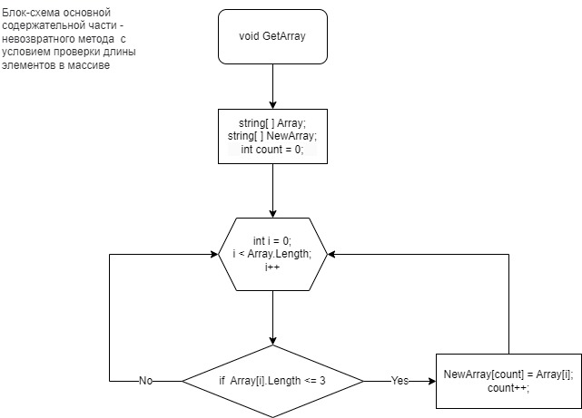

# Итоговая проверочная работа (IT специалист)
**Задача:**

<table>
Написать программу, которая из имеющегося массива строк формирует новый массив из строк, длина которых меньше, либо равна 3 символам. Первоначальный массив можно ввести с клавиатуры, либо задать на старте выполнения алгоритма. При решении не рекомендуется пользоваться коллекциями, лучше обойтись исключительно массивами.
</table>

**Пример:**

[“Hello”, “2”, “world”, “:-)”] → [“2”, “:-)”]
[“1234”, “1567”, “-2”, “computer science”] → [“-2”]
[“Russia”, “Denmark”, “Kazan”] → [*empty*]

**Описание решения**

1. Задаем исходный массив "Array" из 5-ти элементов различной длины;
2. Вводим новый массив "NewArray", который будет получаться после отработки метода по проверке длины элементов в массиве;
3. Вводим метод "GetArray" с условием проверки длины элементов в массиве (вводим цикл):
    *   Если длина элемента массива меньше или равна 3, то элемент выводится;
    * Иначе: элемент не выводится;
4. Выводим "PrintArray" в терминал получившийся массив "NewArray".

**Блок-схема основной содержательной части программы**
